#  AI-Ready ETL Pipeline with Apache Airflow and Google BigQuery

##  Overview

This project implements a **production-style ETL pipeline** using **Apache Airflow**, designed to ingest raw log data from **Google Cloud Storage (GCS)**, perform **AI-ready feature engineering**, and load the transformed data into a **partitioned and clustered Google BigQuery table**.

The pipeline is fully **Dockerized**, monitored through the **Airflow UI**, and includes **failure handling and alerting**, making it suitable for real-world **AI/ML and analytics workflows**.

---

##  Architecture

###  Technologies Used
- Apache Airflow (Docker Compose)
- Google Cloud Storage (Raw data source)
- Python (Data transformation & feature engineering)
- Google BigQuery (Analytics & ML-ready storage)
- SQL (Schema design)
- Docker & Docker Compose

###  High-Level Flow

```text
+---------------------+
|   GCS (Raw Logs)    |
+---------------------+
           |
           v
+---------------------+
|    Airflow DAG      |
+---------------------+
           |
           v
+---------------------+
| Feature Engineering |
|      (Python)       |
+---------------------+
           |
           v
+-------------------------------+
| BigQuery (Partitioned &       |
| Clustered Table)              |
+-------------------------------+
```

---

##  Pipeline Workflow

1. **Extract**
   - Lists raw log files from a GCS bucket using `GCSListObjectsOperator`

2. **Metadata Logging**
   - Logs discovered files using **Airflow XComs** for observability

3. **Transform (AI-Ready Feature Engineering)**
   - Parses TSV log files
   - Cleans and normalizes schema
   - Generates ML-friendly features

4. **Load**
   - Loads transformed data into a **partitioned & clustered BigQuery table**

5. **Monitoring & Alerts**
   - Task retries enabled
   - Email alerts on failure
   - Graph & logs visible in Airflow UI

---

##  AI-Ready Feature Engineering

The pipeline generates the following features suitable for ML tasks such as **anomaly detection**, **classification**, and **time-series analysis**:

| Feature | Description |
|------|------------|
| `event_date` | Date-based partitioning & temporal analysis |
| `hour_of_day` | Captures daily usage patterns |
| `is_error` | Binary failure signal |
| `log_level_encoded` | Numerical encoding for ML models |
| `message_length` | Text-based feature for log intelligence |
| `service_error_rate` | Statistical feature per service |

---

##  BigQuery Table Design

###  Table Name
log_analytics
ai_log_features


###  Schema Highlights
- **Partitioned by:** `event_date`
- **Clustered by:** `service`, `log_level`

###  Benefits
- Fast time-based queries
- Efficient ML feature retrieval
- Scalable analytics and cost optimization

---

##  Monitoring & Failure Handling

- DAG retries configured
- Email alerts enabled on task failure
- Airflow UI used for:
  - DAG status monitoring
  - Task-level logs
  - Debugging & recovery

> Intentional failure testing was performed to validate alerting and monitoring behavior.

---

##  How to Run the Project

### 1️.Start Airflow
```bash
docker compose up airflow-init
docker compose up -d
```

### 2️.Access Airflow UI
```bash
http://127.0.0.1:8080
```

Credentials
```bash
Username: airflow

Password: airflow
```
---

## Project Structure

```text
ai-ready-etl-airflow/
│
├── dags/
│   └── gcs_log_extract_dag.py
├── gcp/
│   └── airflow-etl-sa.json   # (ignored in GitHub)
├── logs/
├── plugins/
├── docker-compose.yaml
├── requirements.txt
├── .env
└── README.md
```

---
## 📸 Screenshots & Execution Evidence

### 1. GCS bucket with raw log file
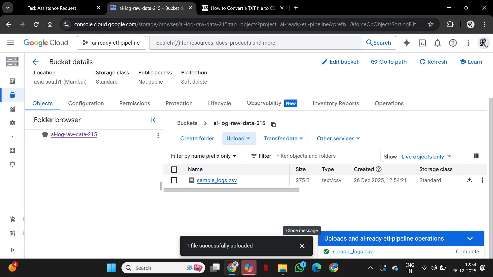

---

### 2. BigQuery dataset created (`log_analytics`)
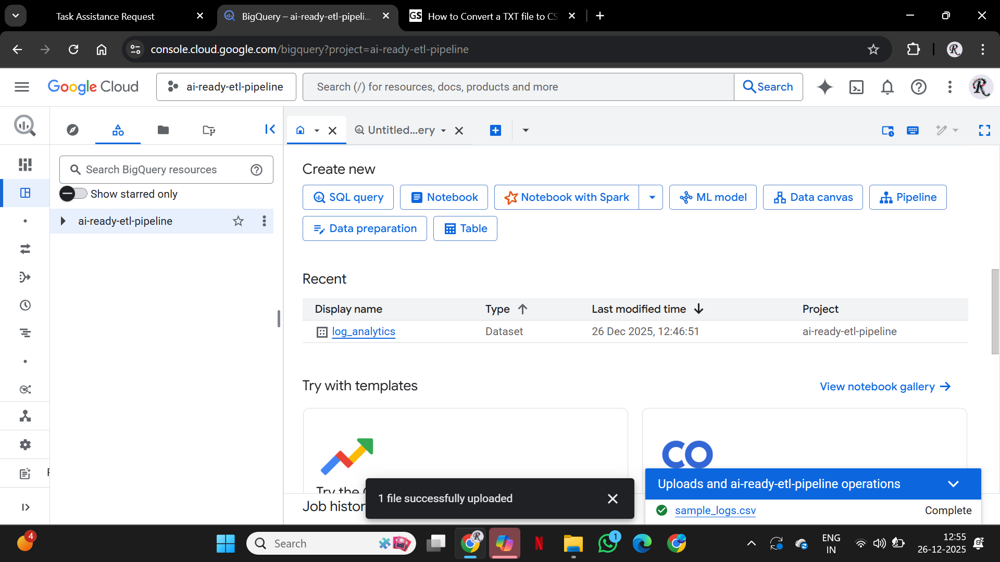

---

### 3. GCP project dashboard
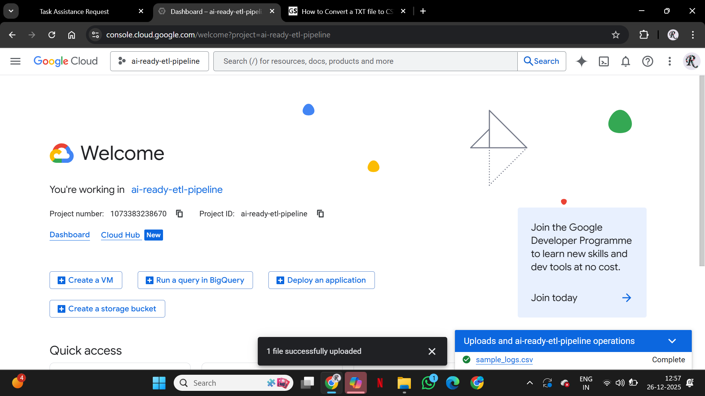

---

### 4. Airflow UI home page (DAGs view)
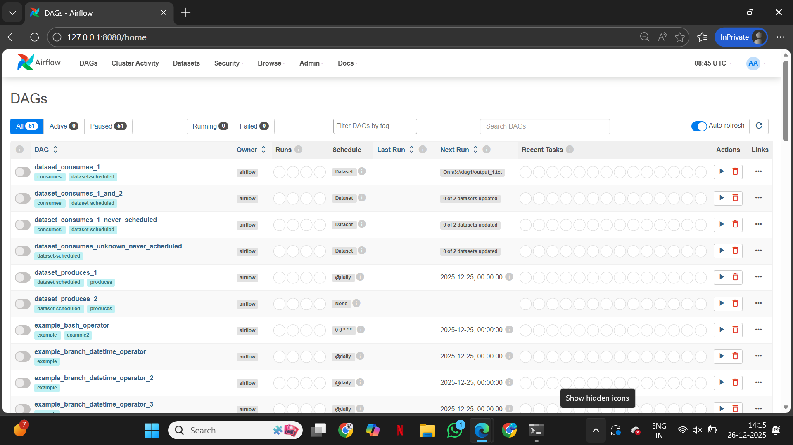

---

### 5. Docker Desktop showing running containers


---

### 6. Terminal output showing `docker compose up -d`


---

### 7. GCP service account created for Airflow


---

### 8. Assigned IAM roles (BigQuery & Storage)


---

### 9. Airflow Connections page (`google_cloud_default`)
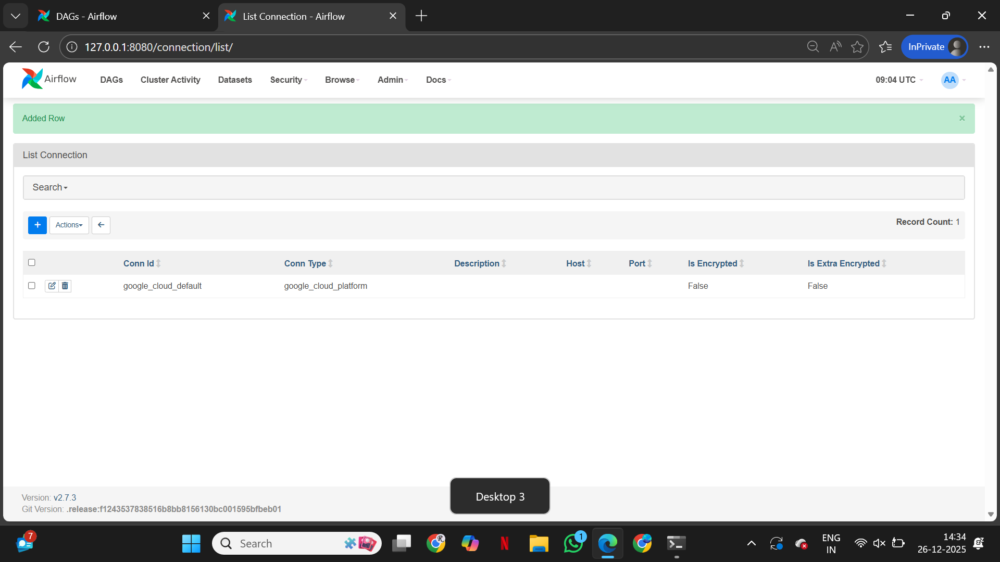

---

### 10. Airflow DAGs page showing `gcs_log_extract_dag`


---

### 11. Graph view with extraction task succeeded


---

### 12. Task logs showing GCS file name


---

### 13. Graph view showing extraction and transformation tasks successful
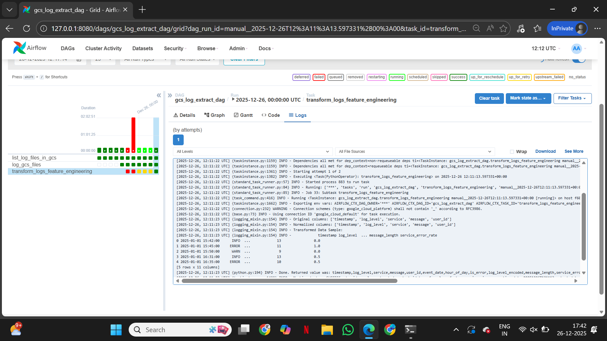

---

### 14. BigQuery table schema with partitioning
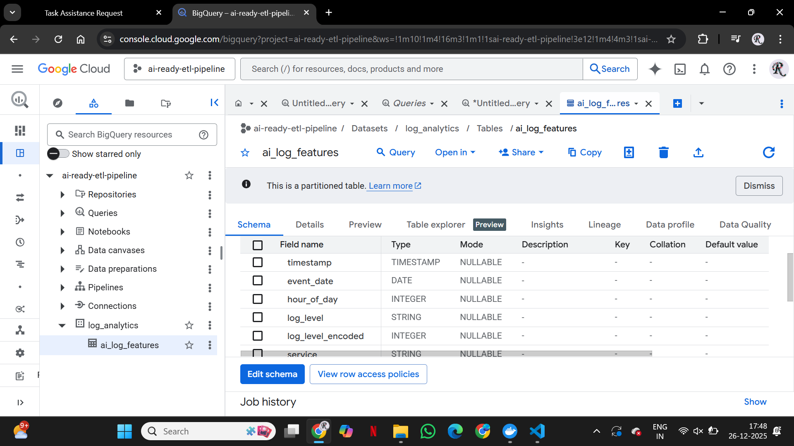

---

### 15. Airflow Graph view with full pipeline successful
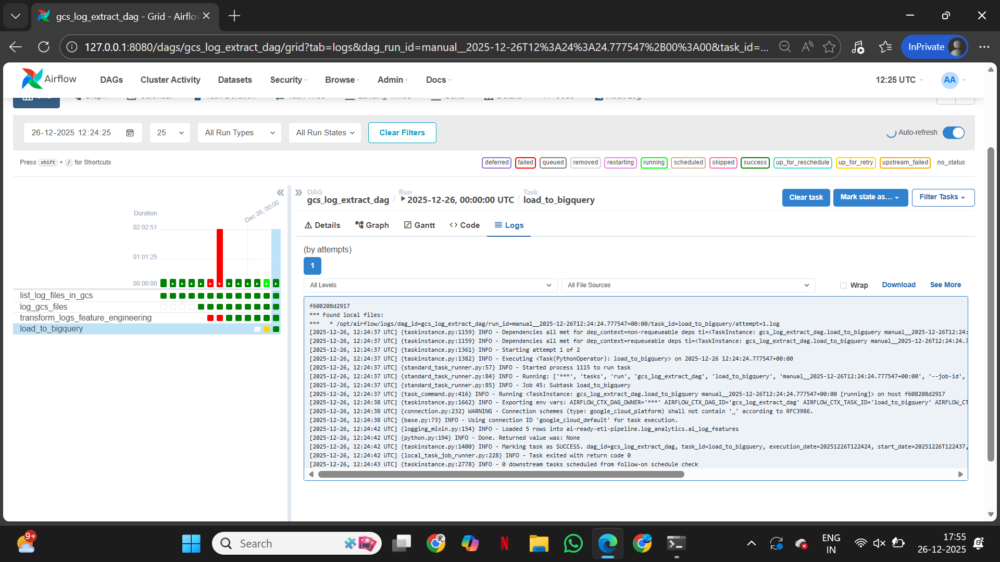

---

### 16. BigQuery query result with loaded data
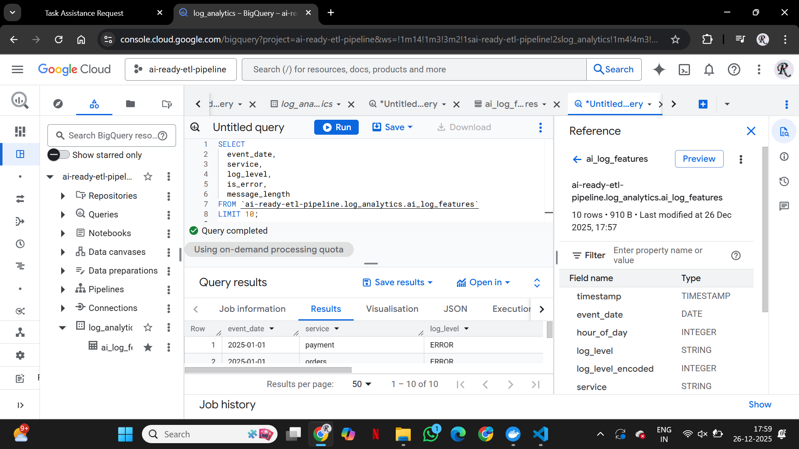

---

### 17. Airflow logs confirming rows loaded into BigQuery
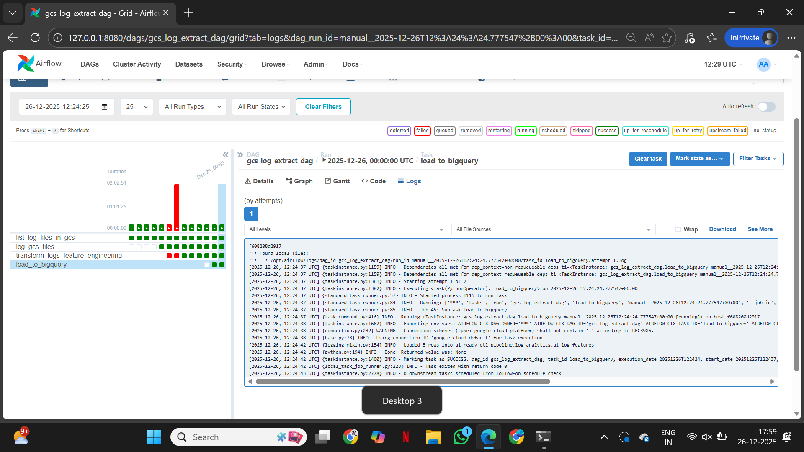

---

### 18. DAG code showing email alert configuration
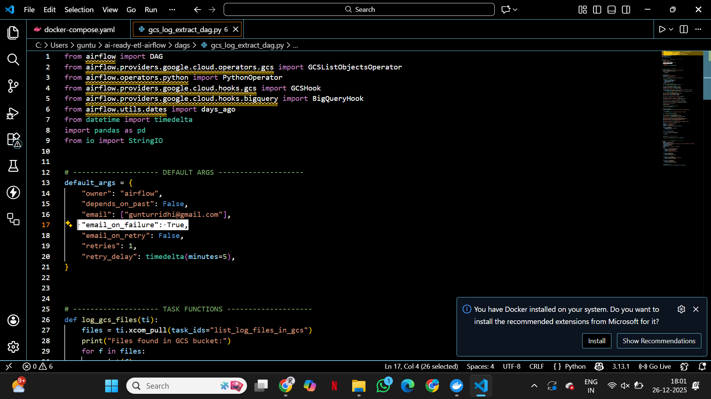

---

### 19. DAG run marked as Failed (intentional test)


---

### 20. Task logs showing intentional failure
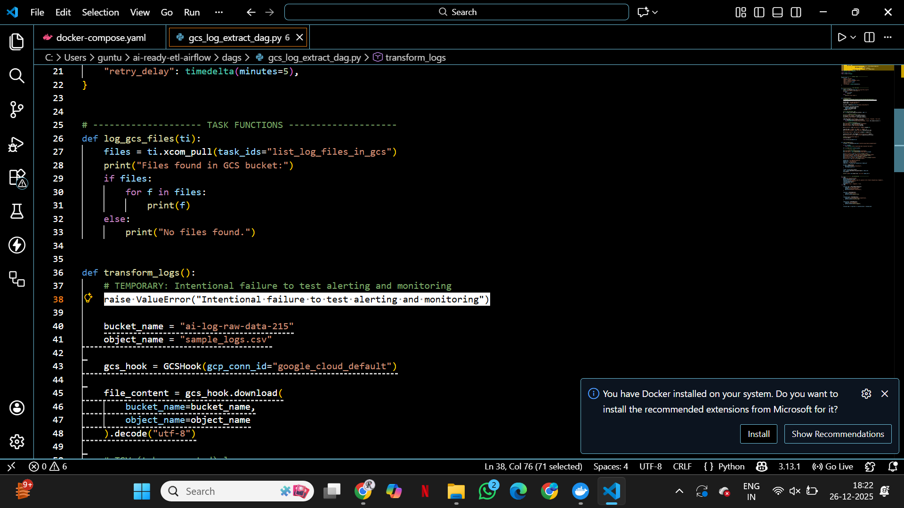

---

### 21. Final successful DAG run after recovery


## Example BigQuery Validation Query
```text
SELECT
  event_date,
  service,
  log_level,
  is_error,
  message_length
FROM `ai-ready-etl-pipeline.log_analytics.ai_log_features`
LIMIT 10;
```

## Key Takeaways

End-to-end ETL orchestration using Apache Airflow

AI-focused feature engineering within the pipeline

Production-grade BigQuery partitioning & clustering

Robust handling of real-world data issues

Monitoring, retries, and alerting included

## Author

Ridhi

AI Engineer Candidate

